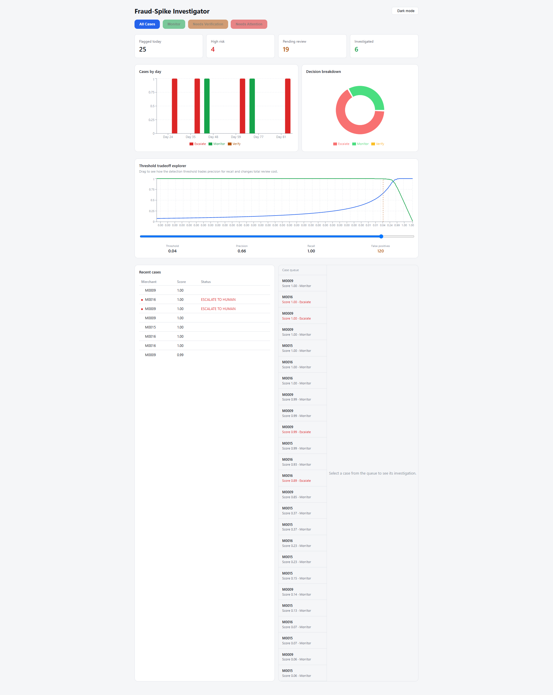
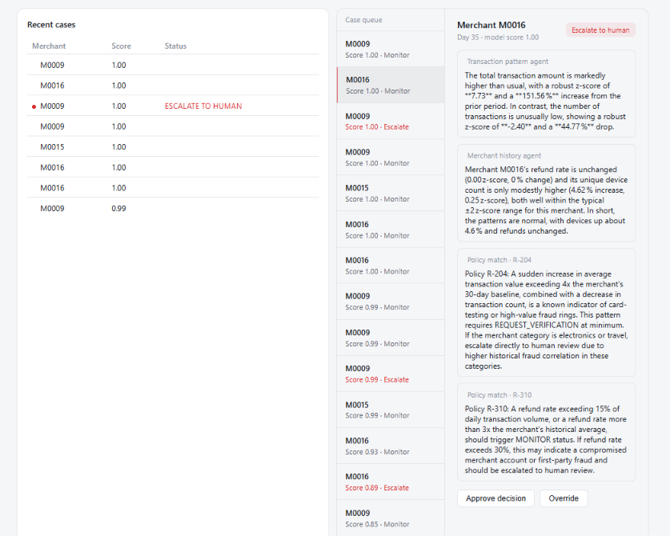

# TraceX
 
> An AI-native merchant risk investigation system — built for the **Razorpay AI Buildathon 2026**, "AI Risk Manager" track. Detects abnormal merchant transaction spikes with a real, evaluated ML model, then runs a multi-agent investigation layer that explains *why* a merchant was flagged and cites the internal policy that applies.
 


 
---

## Screenshots

## Dashboard

<p align="center">
  
</p>

## Case Investigation

<p align="center">
  
</p>


---
 
## Table of Contents
 
1. [Problem Statement](#problem-statement)
2. [Why This Approach](#why-this-approach)
3. [System Architecture](#system-architecture)
4. [Tech Stack](#tech-stack)
5. [ML Detection Layer](#ml-detection-layer)
6. [Agent Investigation Layer](#agent-investigation-layer)
7. [Backend API](#backend-api)
8. [Frontend Dashboard](#frontend-dashboard)
9. [Evaluation Results](#evaluation-results)
10. [Project Structure](#project-structure)
11. [Setup & Running Locally](#setup--running-locally)
12. [What's In Scope vs. Deliberately Out of Scope](#whats-in-scope-vs-deliberately-out-of-scope)
13. [Security & Reliability Considerations](#security--reliability-considerations)
---
 
## Problem Statement
 
Payment platforms process millions of transactions across thousands of merchants. Risk teams need to catch abnormal merchant behavior — sudden transaction spikes, unusual ticket sizes, refund surges, device fan-out — early enough to act, without drowning analysts in false positives.
 
Most fraud-detection demos either output a bare risk score with no explanation, or wrap an LLM around raw data and let it "decide" risk with no real detection model underneath, no measured accuracy, and no accountability for being wrong.
 
**This project scopes to one loss class — merchant transaction-velocity/amount spikes — and treats evaluation as the deliverable, not an afterthought.** The system:
- Detects anomalies with a trained, evaluated ML model (not an LLM)
- Investigates *why* a flagged case looks risky using a small set of specialized agents
- Cites the specific internal policy driving each decision (RAG-based)
- Reports honest precision/recall and false-positive cost — including how often it wrongly flags legitimate spikes like flash sales
## Why This Approach
 
A core design principle throughout: **the LLM explains, it never decides.** Every score, threshold, and action mapping is deterministic code. Agents narrate real feature values and real SHAP attributions — they don't generate risk assessments from scratch. This keeps the system auditable and prevents hallucinated reasoning from driving financial decisions.
 
## System Architecture
 
```
Synthetic Transaction Data (per-merchant daily aggregates)
        ↓
Feature Engineering (rolling robust z-scores, % change, merchant-relative baselines)
        ↓
ML Detector (Isolation Forest baseline + XGBoost classifier, SHAP explainability)
        ↓
Should Investigate? (cost-optimal threshold gate)
   ├─ NO  → logged, no action
   └─ YES ↓
   LangGraph Orchestrator
        ├─ Transaction Pattern Agent   — narrates velocity/amount signal from real features
        ├─ Merchant History Agent      — compares today vs. this merchant's own baseline
        └─ Policy Agent (RAG)          — retrieves matching internal policy, zero LLM calls
        ↓
   Evidence Agent — merges findings, cites policy, checked against SHAP ground truth
        ↓
   Decision Agent — deterministic mapping: (score, policy) → ALLOW / MONITOR /
                     REQUEST_VERIFICATION / ESCALATE_TO_HUMAN
        ↓
FastAPI backend — case logging, human override endpoint, dashboard summary API
        ↓
React dashboard — case queue + evidence panel (risk-analyst tool, not a chatbot)
```
 
## Tech Stack
 
| Layer | Choice | Why |
|---|---|---|
| ML detection | scikit-learn (Isolation Forest), XGBoost, SHAP | Explainable, fast to train, industry-standard for tabular anomaly/fraud detection |
| Agent orchestration | LangGraph + Groq (`openai/gpt-oss-20b`) | Structured, short, evidence-grounded reasoning — a fast/cheap model is the right fit; the LLM never sets the score |
| Policy retrieval | ChromaDB + sentence-transformers (`all-MiniLM-L6-v2`) | Local embeddings, zero API cost for retrieval, fast to stand up |
| Backend | FastAPI + SQLAlchemy + SQLite | Lightweight, zero-ops persistence appropriate for project scope |
| Frontend | React (Vite) | Fast iteration, component-based, matches a dense analyst-tool UI |
 
## ML Detection Layer
 
- **Synthetic dataset**: ~200 merchants × 90 days, with labeled anomalies (velocity spike, amount spike, refund spike, device fan-out) injected at varying severity, *plus* unlabeled benign spikes (flash sales, seasonal demand) to make false-positive evaluation meaningful rather than trivial.
- **Feature engineering**: rolling 14-day robust z-scores (median + MAD) and day-over-day % change per merchant, computed with no future leakage.
- **Baseline detector**: robust z-score thresholding — zero training required.
- **Primary detectors**: Isolation Forest (unsupervised) and XGBoost (supervised), evaluated on held-out **merchants** (not just held-out days) to test generalization, not memorization.
- **Threshold selection**: chosen via an explicit cost curve — false-positive cost (analyst review time, ₹50/case) vs. false-negative cost (undetected loss, ₹2,000/case) — rather than an arbitrary 0.5 cutoff. This deliberately weights missed fraud far more heavily than analyst review time, which is why the optimal threshold favors high recall.
## Agent Investigation Layer
 
Three narrow agents plus an Evidence and Decision agent, orchestrated with LangGraph:
 
- **Transaction Pattern Agent** — describes the velocity/amount deviation using the actual feature values for that merchant-day.
- **Merchant History Agent** — compares current behavior to that specific merchant's own baseline.
- **Policy Agent** — pure retrieval (no LLM call) against a small RAG corpus of internal risk policies (velocity thresholds, refund-rate escalation, device fan-out, promotional exemptions, confidence-band review rules).
- **Evidence Agent** — merges findings into a cited explanation, and is checked against the model's actual SHAP top feature to produce a measured **explanation accuracy** metric.
- **Decision Agent** — deterministic score → action mapping (never an LLM decision).
## Backend API
 
| Endpoint | Purpose |
|---|---|
| `POST /transactions/bulk-load` | Load pre-featured transaction rows, scores each with the ML model, creates a `RiskCase` for anything flagged |
| `GET /risk-cases` | List flagged cases, sorted by score, with current decision |
| `GET /risk-dashboard/by-day` | Case counts grouped by day and decision, for the trend chart |
| `POST /investigations/{case_id}/run` | Runs the LangGraph investigation for a case, persists the result |
| `GET /investigations/{case_id}` | Fetch a completed investigation |
| `POST /investigations/{case_id}/override` | Human-in-the-loop approval/override of the system's decision |
| `GET /risk-dashboard/summary` | Aggregate metrics for the dashboard header |
 
Cases are flagged cheaply by the ML model at ingestion time; the (comparatively expensive, LLM-calling) investigation only runs on-demand for flagged cases — a deliberate cost-control decision.
 
## Frontend Dashboard
 
A dense analyst tool with light/dark mode, metric cards (flagged / high-risk / pending / investigated), a decision-breakdown pie chart, a cases-by-day trend chart, a filterable case queue, and an evidence panel showing each agent's finding as a structured card with the cited policy and a human approve/override action.
 
## Evaluation Results
 
Evaluated on **held-out merchants** never seen during training (3,040 merchant-days, 235 true positives):
 
| Model | Precision | Recall | F1 | PR-AUC |
|---|---|---|---|---|
| Robust Z-Score Baseline | 0.538 | 0.966 | 0.691 | 0.785 |
| Isolation Forest | 0.694 | 0.723 | 0.708 | 0.765 |
| **XGBoost (cost-optimal threshold)** | 0.665 | **0.996** | 0.797 | **0.985** |
 
- **Cost-optimal threshold**: 0.041 → 234 true positives, 118 false positives, only **1 missed fraud case** out of 235.
- **Benign-spike false positive rate** (the key evidence that the system distinguishes real risk from ordinary demand variation, e.g. flash sales): of 126 legitimate spike days in the test set, the Z-score baseline incorrectly flagged 122, while the final XGBoost model flagged 76 — a meaningful reduction, though still an area for future tuning.
- **Explanation accuracy**: the agent layer's stated reasoning matched the model's actual top SHAP contributing feature in **11/15 (73.3%)** of investigated cases — a rare, quantified explainability metric most agentic fraud demos don't measure at all.
## Project Structure
 
```
fraud-spike-investigator/
├── backend/
│   ├── app.py                  # FastAPI app + routes
│   ├── db.py                    # SQLAlchemy models + session
│   ├── schemas.py                 # Pydantic request/response models
│   ├── ml_pipeline.py               # Loads trained XGBoost model + scoring logic
│   ├── agent_pipeline.py              # LangGraph investigation graph + policy RAG
│   ├── xgb_fraud_spike.json             # Trained model (exported from notebook)
│   ├── decision_threshold.pkl             # Cost-optimal decision threshold
│   ├── cost_curve.json                      # Precision/recall/cost tradeoff table
│   └── requirements.txt
└── frontend/
    ├── index.html
    └── src/
        ├── main.jsx
        ├── App.jsx
        ├── Dashboard.jsx
        ├── theme.css
        └── components/
            ├── MetricCard.jsx
            ├── CaseQueue.jsx
            ├── CaseDetail.jsx
            ├── EvidenceCard.jsx
            ├── CasesBarChart.jsx
            ├── CasesTable.jsx
            ├── CategoryPills.jsx
            ├── DecisionPieChart.jsx
            └── ThemeToggle.jsx
```
 
## Setup & Running Locally
 
**Backend:**
```bash
cd backend
python -m venv venv
venv\Scripts\activate        # or source venv/bin/activate on Mac/Linux
pip install -r requirements.txt
# create a .env file with: GROQ_API_KEY=your-key-here
uvicorn app:app --reload --port 8000
```
API docs at `http://localhost:8000/docs`.
 
**Frontend:**
```bash
cd frontend
npm install
npm run dev
```
Dashboard at `http://localhost:5173`.
 
**Model training** (Google Colab notebook, run once, export artifacts): generate synthetic data → engineer features → train Isolation Forest + XGBoost, evaluate on held-out merchants → export `xgb_fraud_spike.json`, `decision_threshold.pkl`, `cost_curve.json` → place in `backend/`.
 
## What's In Scope vs. Deliberately Out of Scope
 
**In scope:** one loss class (transaction-velocity/amount spikes), real evaluated detection, a narrow 5-agent investigation layer, policy RAG, human-review override, a working dashboard.
 
**Deliberately out of scope** (designed but not built, to protect depth over breadth): graph/network fraud-ring analysis across merchants/devices, a second loss class (e.g., refund-rate spikes) on the same pipeline, full analyst case-management workflow (assignment, SLA tracking), parallel agent execution, a public-facing deployment (per the buildathon brief, a public repo, demo video, and architecture are the required deliverables — no live hosted link is required).
 
## Security & Reliability Considerations
 
- **No offense-capable output**: the system only classifies and explains risk; it does not generate fraud techniques or evasion guidance.
- **Deterministic decisions**: the LLM layer never sets the risk score or chooses the action — both come from the trained model and fixed business rules, limiting the blast radius of any single hallucinated agent response.
- **Ambiguous-confidence handling**: cases in the 0.4–0.7 model-confidence band are never auto-actioned; they route to human review by policy (R-600).
- **Explanation grounding check**: each Evidence Agent output is checked against the model's actual SHAP top feature, catching cases where the narrated reasoning has drifted from what the model actually detected.
 